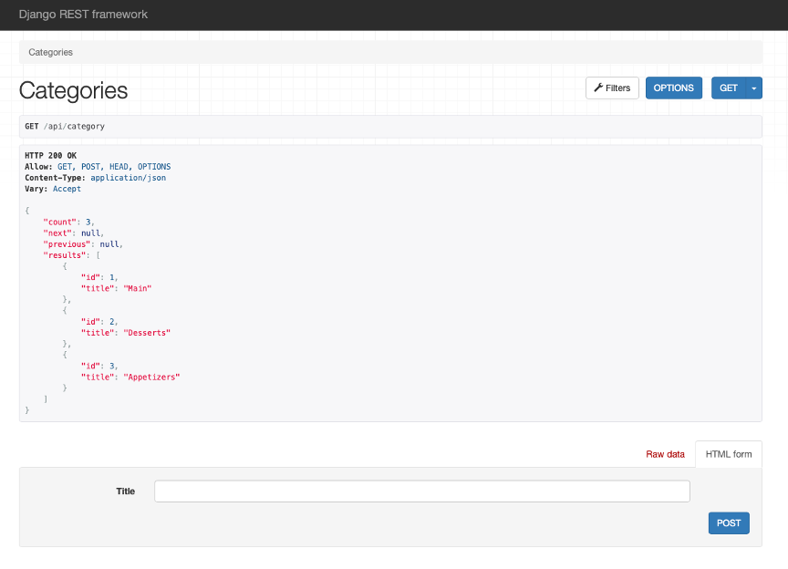
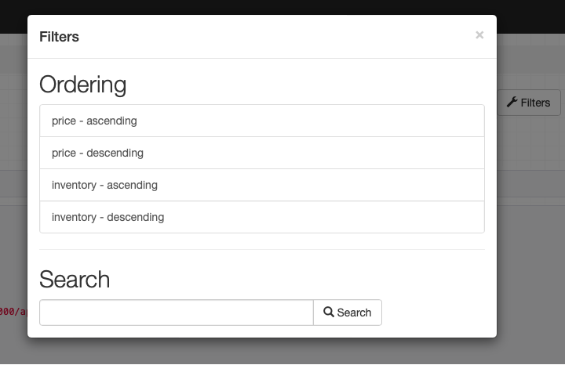
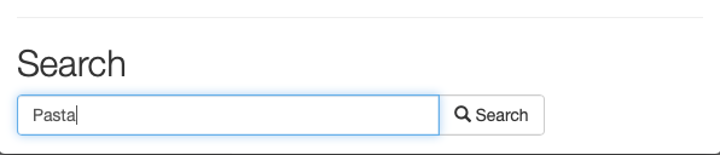
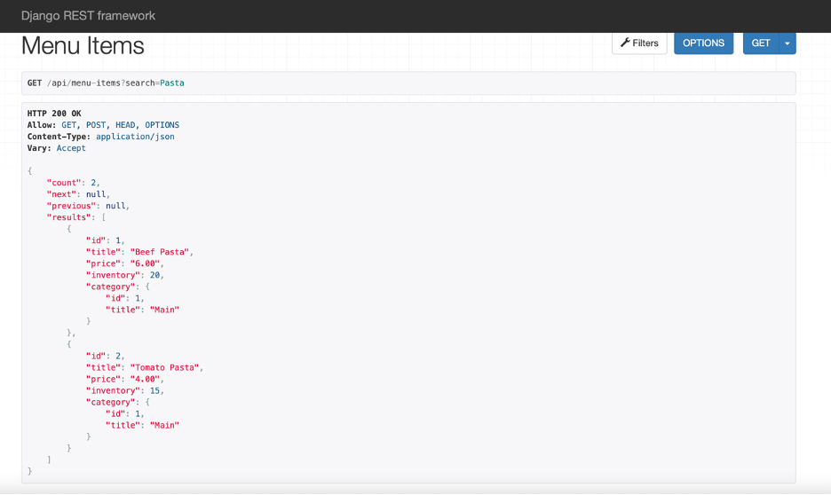

# Restaurant Menu API - Filtering, Ordering and Searching

**Goal**

Add functionalities such as pagination, ordering and searching in HTML form using DRF

**Objectives**

- Create HTML forms and add new items
- Add pagination settings for DRF form
- Add filtering options such as ordering and searching

**Introduction**

In this project, I created a model called **Category** and another model called **Menu** that has a many-to-one relationship with the model **Category**. I used DRF to add searching and ordering functionalities. I also learned how to generate a view consisting of a specific number of items from a table that will be displayed on a page.

Open the **Terminal** and run both commands to perform migrations.
Once the migrations are performed successfully, run the command to start the server on localhost and go to the URL:

`http://127.0.0.1:8000/api/category`

Update the data entries in the form as follows:

**- Title: Main**

**- Title: Desserts**

**- Title: Appetizers**

On updating, the entries should appear as below:

Now go to the URL for **menu-items** by adding the link inside the browser:

`http://127.0.0.1:8000/api/menu-items`

Now click on the **Filter** button that you can see on the page and under the options listed, click on the option **price – ascending**.

Scroll through the items listed and note the price listed is set to ascending order of value.

You can try different order options from the list and note the changes in the order of the menu items displayed.

Click on the **Filter** option again and below the **Search** option, enter the value **"Pasta"** in the text field and click on the Search button to the right.

The result displayed should return all the relevant items that contain the substring **"pasta"** inside it.

Notice that the specific total count has also been updated to **2**.

Also, note how the search results displayed are case-insensitive and will return results irrespective of the case used.

Now go to the **Search** option inside the Filter one more time and search for the term **main** inside it.

The count of results displayed this time will be **null.** This shows that the search only displays items present for the options configured inside the view function which in this case will be the 'title' inside the `Menu` model. The term **main** , which is a type of **category**, will not be a part of the search. Other entries such as entering **4.00** in the search box will also return **null,** as the count with empty list as the result. And will return an empty list showing `"count"` as **0**.

**Concluding Thoughts**

In this lab, I practiced configuring the settings for pagination in DRF. I also learned how to add filtering options such as ordering and searching inside the form data. Finally, I used DRF to implement models having a many-to-one relationship.
